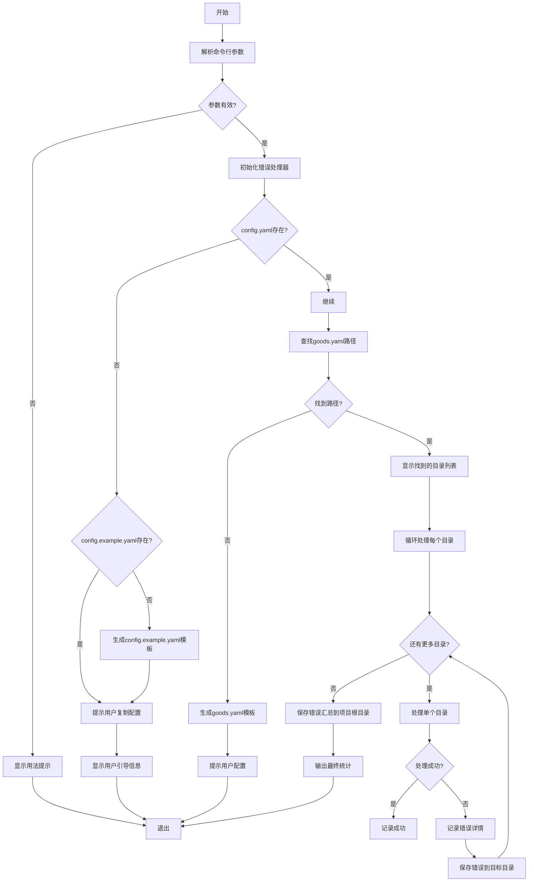
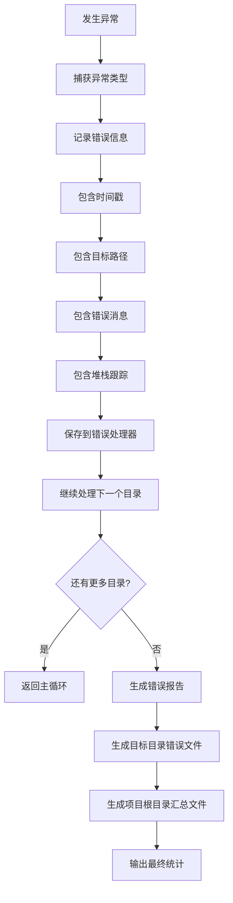

# BuyerShowTool 开发计划文档

## 文档概述

本文档为 BuyerShowTool Python 项目的功能增强开发计划，基于以下需求进行设计：
- 增强用户引导逻辑
- 深度遍历目录查找 goods.yaml
- 完善的错误处理和报告机制

---

## 一、需求分析

### 1.1 需求一：用户引导逻辑增强

**需求描述**：
- 在启动时检测不到 `config.yaml` 文件
- 自动寻找并生成 `config.example.yaml` 供用户参考
- 自动生成 `goods.yaml` 模板文件供用户参考

**当前行为**：
- [`src/config/loader.py:10-11`](src/config/loader.py:10) 中直接抛出异常：`raise FileNotFoundError(f"配置文件不存在: {config_path}，请创建配置文件")`

**期望行为**：
1. 检测 `config.yaml` 是否存在
2. 如果不存在，检查 `config.example.yaml` 是否已存在
3. 如果 `config.example.yaml` 也不存在，从内置模板生成该文件
4. 同时生成 `goods.yaml` 模板文件到目标路径（如果目标路径下不存在）
5. 提示用户如何配置并退出程序

### 1.2 需求二：深度遍历目录查找 goods.yaml

**需求描述**：
- 用户传入一个路径，但该路径下可能不存在 `goods.yaml`
- 可能存在多个文件夹，需要递归下探遍历
- 找到所有拥有 `goods.yaml` 的直接文件夹
- 以这些文件夹作为目标路径数组，逐一进行生成操作

**当前行为**：
- [`src/config/loader.py:61-64`](src/config/loader.py:61) 中只检查目标路径下直接是否存在 `goods.yaml`

**期望行为**：
1. 接收用户传入的路径
2. 检查该路径下是否存在 `goods.yaml`
3. 如果不存在，检查是否存在子文件夹
4. 如果存在子文件夹，递归遍历所有子文件夹
5. 收集所有包含 `goods.yaml` 的文件夹路径
6. 对每个路径逐一执行生成操作
7. 支持多级目录嵌套遍历

### 1.3 需求三：完善的错误处理和报告机制

**需求描述**：
- 生成过程中发生错误不要直接崩溃或终止进程
- 详细记录 error 内容
- 多份输出：
  - 一份输出到当前操作的 goods.yaml 路径位置（作为当前路径下的错误明细报告）
  - 一份输出到当前项目的路径下（作为本次运行期间所有 error 信息的汇总）

**当前行为**：
- [`src/index.py:85-98`](src/index.py:85) 中使用 try-except 捕获异常，但直接调用 `sys.exit(1)` 终止进程

**期望行为**：
1. 捕获所有类型的异常
2. 记录详细的错误信息（包含时间、路径、错误类型、堆栈信息）
3. 在每个目标路径下生成 `error_detail.log` 文件
4. 在项目根目录生成 `run_error_summary.log` 文件
5. 继续处理下一个目标路径（不终止整个进程）
6. 汇总所有错误信息并在最后输出

---

## 二、详细设计

### 2.1 模块结构设计

```
src/
├── __init__.py
├── index.py                      # 主入口（需修改）
├── config/
│   ├── __init__.py
│   ├── loader.py                 # 配置加载器（需修改）
│   ├── types.py                  # 类型定义
│   └── guide.py                  # 新增：用户引导模块
├── services/
│   ├── __init__.py
│   ├── goodsParser.py
│   ├── reviewGenerator.py
│   └── imageGenerator.py
├── api/
│   ├── __init__.py
│   ├── deepseek.py
│   └── tongyi.py
├── utils/
│   ├── __init__.py
│   ├── logger.py
│   ├── file.py
│   └── error_handler.py          # 新增：错误处理模块
```

### 2.2 新增模块设计

#### 2.2.1 用户引导模块 (src/config/guide.py)

**职责**：
- 检测并生成配置文件
- 检测并生成商品配置模板
- 提供用户引导提示信息

**关键函数**：

```python
def ensure_config_exists() -> bool:
    """
    确保 config.yaml 存在，如果不存在则生成 config.example.yaml
    
    Returns:
        bool: config.yaml 是否已存在
    """
    pass

def generate_config_example() -> str:
    """
    生成 config.example.yaml 模板文件
    
    Returns:
        str: 生成的模板文件路径
    """
    pass

def generate_goods_template(target_dir: str) -> str:
    """
    生成 goods.yaml 模板文件到目标目录
    
    Args:
        target_dir: 目标目录路径
    
    Returns:
        str: 生成的模板文件路径
    """
    pass

def print_guide_message(config_exists: bool, goods_exists: bool):
    """
    打印用户引导提示信息
    
    Args:
        config_exists: config.yaml 是否存在
        goods_exists: goods.yaml 是否存在
    """
    pass
```

#### 2.2.2 错误处理模块 (src/utils/error_handler.py)

**职责**：
- 收集和记录错误信息
- 生成错误报告文件
- 管理错误汇总

**关键函数**：

```python
from dataclasses import dataclass, field
from datetime import datetime
from typing import List, Optional

@dataclass
class ErrorRecord:
    """错误记录数据类"""
    timestamp: str
    target_path: str
    error_type: str
    error_message: str
    stack_trace: Optional[str] = None

class ErrorHandler:
    """错误处理器"""
    
    def __init__(self, project_root: str):
        """
        初始化错误处理器
        
        Args:
            project_root: 项目根目录路径
        """
        self.project_root = project_root
        self.errors: List[ErrorRecord] = []
    
    def record_error(
        self, 
        target_path: str, 
        error_type: str, 
        error_message: str, 
        stack_trace: Optional[str] = None
    ):
        """
        记录一个错误
        
        Args:
            target_path: 目标路径
            error_type: 错误类型
            error_message: 错误消息
            stack_trace: 堆栈跟踪（可选）
        """
        error_record = ErrorRecord(
            timestamp=datetime.now().strftime("%Y-%m-%d %H:%M:%S"),
            target_path=target_path,
            error_type=error_type,
            error_message=error_message,
            stack_trace=stack_trace
        )
        self.errors.append(error_record)
    
    def save_detail_error(self, target_path: str):
        """
        保存当前目标路径的错误详情到目标目录
        
        Args:
            target_path: 目标路径
        """
        # 筛选当前目标路径的错误
        target_errors = [e for e in self.errors if e.target_path == target_path]
        if not target_errors:
            return
        
        # 生成错误报告内容
        content = self._format_error_report(target_errors)
        
        # 写入目标目录
        error_file = os.path.join(target_path, "error_detail.log")
        with open(error_file, 'w', encoding='utf-8') as f:
            f.write(content)
    
    def save_summary_error(self):
        """
        保存所有错误的汇总报告到项目根目录
        """
        if not self.errors:
            return
        
        content = self._format_error_report(self.errors)
        
        # 写入项目根目录
        error_file = os.path.join(self.project_root, "run_error_summary.log")
        with open(error_file, 'w', encoding='utf-8') as f:
            f.write(content)
    
    def _format_error_report(self, errors: List[ErrorRecord]) -> str:
        """
        格式化错误报告
        
        Args:
            errors: 错误记录列表
        
        Returns:
            str: 格式化的错误报告
        """
        lines = [
            "=" * 60,
            "错误报告",
            "=" * 60,
            f"生成时间: {datetime.now().strftime('%Y-%m-%d %H:%M:%S')}",
            f"错误总数: {len(errors)}",
            "=" * 60,
            ""
        ]
        
        for i, error in enumerate(errors, 1):
            lines.extend([
                f"--- 错误 #{i} ---",
                f"时间: {error.timestamp}",
                f"目标路径: {error.target_path}",
                f"错误类型: {error.error_type}",
                f"错误消息: {error.error_message}",
            ])
            if error.stack_trace:
                lines.extend([
                    "堆栈跟踪:",
                    error.stack_trace
                ])
            lines.append("")
        
        return "\n".join(lines)
    
    def has_errors(self) -> bool:
        """检查是否有错误记录"""
        return len(self.errors) > 0
    
    def get_error_count(self) -> int:
        """获取错误总数"""
        return len(self.errors)
```

### 2.3 目录遍历模块设计

**职责**：
- 递归遍历目录查找包含 goods.yaml 的文件夹
- 收集所有有效目标路径

**关键函数**：

```python
def find_goods_yaml_paths(root_path: str) -> List[str]:
    """
    递归查找所有包含 goods.yaml 的文件夹路径
    
    Args:
        root_path: 根路径
    
    Returns:
        List[str]: 包含 goods.yaml 的文件夹路径列表
    """
    result = []
    
    # 检查当前路径是否包含 goods.yaml
    goods_yaml_path = os.path.join(root_path, "goods.yaml")
    if os.path.exists(goods_yaml_path):
        result.append(root_path)
        return result  # 找到后不再深入搜索子目录
    
    # 如果当前目录没有 goods.yaml，遍历子目录
    if os.path.isdir(root_path):
        for item in os.listdir(root_path):
            item_path = os.path.join(root_path, item)
            if os.path.isdir(item_path):
                # 递归搜索子目录
                sub_results = find_goods_yaml_paths(item_path)
                result.extend(sub_results)
    
    return result


def find_goods_yaml_paths_deep(root_path: str) -> List[str]:
    """
    深度遍历查找所有包含 goods.yaml 的文件夹路径
    与 find_goods_yaml_paths 的区别：
    - 找到 goods.yaml 后仍继续搜索子目录
    - 适用于需要批量处理多个商品目录的场景
    
    Args:
        root_path: 根路径
    
    Returns:
        List[str]: 包含 goods.yaml 的文件夹路径列表
    """
    result = []
    
    # 检查当前路径是否包含 goods.yaml
    goods_yaml_path = os.path.join(root_path, "goods.yaml")
    if os.path.exists(goods_yaml_path):
        result.append(root_path)
    
    # 继续遍历子目录
    if os.path.isdir(root_path):
        for item in os.listdir(root_path):
            item_path = os.path.join(root_path, item)
            if os.path.isdir(item_path):
                sub_results = find_goods_yaml_paths_deep(item_path)
                result.extend(sub_results)
    
    return result
```

---

## 三、修改方案

### 3.1 修改 src/index.py

**修改点**：

1. 导入新模块
```python
from src.config.guide import ensure_config_exists, generate_goods_template, print_guide_message
from src.utils.error_handler import ErrorHandler
from src.utils.file import find_goods_yaml_paths
```

2. 修改 main 函数逻辑
```python
def main():
    """主入口函数"""
    # 解析命令行参数
    if len(sys.argv) < 2:
        print("用法: python src/index.py <目标目录路径>")
        print("示例: python src/index.py C:\\example\\dir")
        sys.exit(1)
    
    target_dir = sys.argv[1]
    
    # 验证目标目录
    if not os.path.exists(target_dir):
        print(f"错误: 目标目录不存在: {target_dir}")
        sys.exit(1)
    
    if not os.path.isdir(target_dir):
        print(f"错误: 目标路径不是目录: {target_dir}")
        sys.exit(1)
    
    # 初始化错误处理器
    project_root = os.path.dirname(os.path.abspath(__file__))
    error_handler = ErrorHandler(project_root)
    
    # 检查配置文件
    config_exists = ensure_config_exists()
    if not config_exists:
        print_guide_message(config_exists=False, goods_exists=False)
        sys.exit(1)
    
    # 查找所有包含 goods.yaml 的目标路径
    print("正在搜索商品配置目录...")
    target_paths = find_goods_yaml_paths(target_dir)
    
    if not target_paths:
        # 如果没有找到，尝试在目标目录生成 goods.yaml 模板
        print(f"未在 {target_dir} 下找到 goods.yaml，正在生成模板...")
        generate_goods_template(target_dir)
        print_guide_message(config_exists=True, goods_exists=False)
        sys.exit(1)
    
    print(f"找到 {len(target_paths)} 个商品配置目录:")
    for path in target_paths:
        print(f"  - {path}")
    print()
    
    # 逐一处理每个目标路径
    success_count = 0
    for i, path in enumerate(target_paths, 1):
        print(f"\n{'='*50}")
        print(f"处理第 {i}/{len(target_paths)} 个目录: {path}")
        print(f"{'='*50}\n")
        
        try:
            process_single_target(path, error_handler)
            success_count += 1
        except Exception as e:
            # 记录错误但不终止进程
            import traceback
            error_handler.record_error(
                target_path=path,
                error_type=type(e).__name__,
                error_message=str(e),
                stack_trace=traceback.format_exc()
            )
            print(f"处理目录 {path} 时发生错误: {e}")
            print("继续处理下一个目录...\n")
    
    # 保存错误报告
    error_handler.save_summary_error()
    for path in target_paths:
        error_handler.save_detail_error(path)
    
    # 输出汇总信息
    print("\n" + "=" * 50)
    print("任务完成!")
    print("=" * 50)
    print(f"成功处理: {success_count}/{len(target_paths)} 个目录")
    
    if error_handler.has_errors():
        print(f"错误数量: {error_handler.get_error_count()}")
        print(f"错误详情已保存到:")
        print(f"  - 项目根目录: run_error_summary.log")
        for path in target_paths:
            print(f"  - {path}: error_detail.log")
    
    sys.exit(0 if success_count == len(target_paths) else 1)


def process_single_target(target_dir: str, error_handler: ErrorHandler):
    """处理单个目标目录"""
    # 设置日志
    logger = setup_logger(target_dir)
    
    print(f"目标目录: {target_dir}")
    print()
    
    # 加载配置
    print("正在加载配置...")
    config, goods_data = load_all_config(target_dir)
    print(f"商品名称: {goods_data.goods.name}")
    print(f"商品图片: {goods_data.images}")
    print()
    
    # 生成好评文案
    print("-" * 50)
    print("开始生成好评文案...")
    print("-" * 50)
    review_generator = ReviewGenerator(config)
    reviews = review_generator.generate_reviews(goods_data, target_dir)
    
    if reviews:
        print(f"成功生成 {len(reviews)} 条好评文案")
    else:
        print("警告: 未能生成好评文案")
    print()
    
    # 生成买家秀图片
    print("-" * 50)
    print("开始生成买家秀图片...")
    print("-" * 50)
    image_generator = ImageGenerator(config)
    image_paths = image_generator.generate_buyer_show_images(goods_data, target_dir)
    
    if image_paths:
        print(f"成功生成 {len(image_paths)} 张买家秀图片")
    else:
        print("警告: 未能生成买家秀图片")
    print()
    
    # 完成
    print("-" * 50)
    print(f"目录 {target_dir} 处理完成!")
    print("-" * 50)
```

### 3.2 修改 src/config/loader.py

**修改点**：

1. 添加配置检查和生成功能
```python
def check_and_generate_config() -> bool:
    """检查并生成配置文件"""
    config_path = "config.yaml"
    example_path = "config.example.yaml"
    
    if os.path.exists(config_path):
        return True
    
    # 检查 config.example.yaml 是否存在
    if not os.path.exists(example_path):
        # 生成模板文件
        generate_config_example(example_path)
    
    return False
```

2. 添加 goods.yaml 模板生成功能
```python
def generate_goods_yaml_template(target_dir: str) -> str:
    """生成 goods.yaml 模板"""
    template = """# 商品基本信息
goods:
  # 商品名称
  name: "商品名称"
  # 品类
  category: "品类"
  # 适用性别
  gender: "男"
  # 适用年龄
  ageGroup: "青年"
  # 年份
  year: "2024"
  # 季节
  season: "春夏季"
  # 裤长（如果是裤子）
  pantsLength: ""
  # 袖长
  sleeveLength: "短袖"
  # 领型
  collarType: "圆领"
  # 穿戴方式
  wearType: "套头"
  # 特殊卖点或功能
  features:
    - "卖点1"
    - "卖点2"

# 商品图片文件列表（支持 jpg/jpeg/png）
images:
  - "front.jpg"
  - "back.jpg"
"""
    goods_yaml_path = os.path.join(target_dir, "goods.yaml")
    with open(goods_yaml_path, 'w', encoding='utf-8') as f:
        f.write(template)
    return goods_yaml_path
```

### 3.3 修改 src/utils/file.py

**修改点**：

添加目录遍历函数
```python
def find_goods_yaml_paths(root_path: str, deep: bool = False) -> List[str]:
    """
    查找所有包含 goods.yaml 的文件夹路径
    
    Args:
        root_path: 根路径
        deep: 是否深度遍历（找到后仍继续搜索子目录）
    
    Returns:
        List[str]: 包含 goods.yaml 的文件夹路径列表
    """
    result = []
    
    goods_yaml_path = os.path.join(root_path, "goods.yaml")
    if os.path.exists(goods_yaml_path):
        result.append(root_path)
        if not deep:
            return result
    
    if os.path.isdir(root_path):
        for item in os.listdir(root_path):
            item_path = os.path.join(root_path, item)
            if os.path.isdir(item_path):
                sub_results = find_goods_yaml_paths(item_path, deep)
                result.extend(sub_results)
    
    return result
```

---

## 四、流程图

### 4.1 主流程图



### 4.2 错误处理流程图



---

## 五、文件清单

### 5.1 需要修改的文件

| 文件路径 | 修改内容 |
|---------|---------|
| [`src/index.py`](src/index.py) | 重构主入口，添加错误处理和目录遍历逻辑 |
| [`src/config/loader.py`](src/config/loader.py) | 添加配置检查和模板生成功能 |
| [`src/utils/file.py`](src/utils/file.py) | 添加目录遍历函数 |

### 5.2 需要新建的文件

| 文件路径 | 说明 |
|---------|------|
| [`src/config/guide.py`](src/config/guide.py) | 用户引导模块 |
| [`src/utils/error_handler.py`](src/utils/error_handler.py) | 错误处理模块 |

---

## 六、测试用例设计

### 6.1 用户引导逻辑测试

| 测试场景 | 预期结果 |
|---------|---------|
| config.yaml 不存在 | 自动生成 config.example.yaml，提示用户 |
| config.yaml 已存在 | 正常加载配置 |
| 目标目录无 goods.yaml | 生成 goods.yaml 模板，提示用户 |
| 目标目录有 goods.yaml | 正常加载商品信息 |

### 6.2 目录遍历测试

| 测试场景 | 预期结果 |
|---------|---------|
| 目标目录直接包含 goods.yaml | 返回该目录路径 |
| 目标目录包含子文件夹，子文件夹包含 goods.yaml | 返回子文件夹路径列表 |
| 多级嵌套目录，每级都有 goods.yaml | 返回所有包含 goods.yaml 的路径 |
| 目标目录无 goods.yaml 且无子文件夹 | 返回空列表 |

### 6.3 错误处理测试

| 测试场景 | 预期结果 |
|---------|---------|
| 单个目录处理失败 | 记录错误，继续处理下一个 |
| 多个目录处理，部分失败 | 汇总所有错误，生成两份报告 |
| API 调用失败 | 捕获异常，记录详细错误信息 |
| 文件写入失败 | 捕获异常，记录错误，继续执行 |

---

## 七、注意事项

1. **向后兼容**：修改后的代码应保持与现有功能兼容
2. **错误隔离**：单个目录处理失败不应影响其他目录的处理
3. **日志清晰**：错误报告应包含足够的调试信息
4. **用户友好**：引导信息应清晰指导用户如何配置
5. **性能考虑**：深度遍历时应注意避免过深的递归导致的性能问题

---

## 八、预期效果

### 8.1 用户首次运行（无配置文件）

```
$ python src/index.py C:\example\dir

==================================================
BuyerShowTool - 买家秀生成工具
==================================================

错误: 配置文件不存在
请先配置项目:
1. 复制 config.example.yaml 为 config.yaml
2. 修改 config.yaml 中的 API 密钥配置
3. 重新运行程序

配置文件已生成: C:\project\config.example.yaml
```

### 8.2 用户运行（目标目录无 goods.yaml）

```
$ python src/index.py C:\example\dir

==================================================
BuyerShowTool - 买家秀生成工具
==================================================

未在 C:\example\dir 下找到 goods.yaml
商品配置模板已生成: C:\example\dir\goods.yaml

请编辑 goods.yaml 配置商品信息后重新运行
```

### 8.3 用户运行（多目录批量处理）

```
$ python src/index.py C:\example\parent

==================================================
BuyerShowTool - 买家秀生成工具
==================================================

正在搜索商品配置目录...
找到 3 个商品配置目录:
  - C:\example\parent\dir1
  - C:\example\parent\dir2
  - C:\example\parent\dir3

==================================================
处理第 1/3 个目录: C:\example\parent\dir1
==================================================

目标目录: C:\example\parent\dir1
商品名称: 商品A
...

==================================================
处理第 2/3 个目录: C:\example\parent\dir2
==================================================

目标目录: C:\example\parent\dir2
商品名称: 商品B
...

==================================================
处理第 3/3 个目录: C:\example\parent\dir3
==================================================

目标目录: C:\example\parent\dir3
商品名称: 商品C
...

==================================================
任务完成!
==================================================
成功处理: 3/3 个目录
```

### 8.4 错误报告示例

**目标目录错误报告 (error_detail.log)**:
```
============================================================
错误报告
============================================================
生成时间: 2024-01-01 12:00:00
错误总数: 1
============================================================

--- 错误 #1 ---
时间: 2024-01-01 12:00:00
目标路径: C:\example\dir1
错误类型: ValueError
错误消息: 商品信息缺少必要字段: name
堆栈跟踪:
Traceback (most recent call last):
  File "src/config/loader.py", line 83, in load_goods_data
    raise ValueError(f"商品信息缺少必要字段: {field}")
ValueError: 商品信息缺少必要字段: name
```

**项目根目录汇总报告 (run_error_summary.log)**:
```
============================================================
错误报告
============================================================
生成时间: 2024-01-01 12:00:00
错误总数: 2
============================================================

--- 错误 #1 ---
时间: 2024-01-01 12:00:00
目标路径: C:\example\dir1
错误类型: ValueError
错误消息: 商品信息缺少必要字段: name

--- 错误 #2 ---
时间: 2024-01-01 12:00:05
目标路径: C:\example\dir2
错误类型: requests.exceptions.RequestException
错误消息: API 请求失败: Connection timeout
```

---

## 九、总结

本开发计划文档详细描述了以下三个需求的实现方案：

1. **用户引导逻辑增强**：通过新增 `guide.py` 模块，实现配置文件和商品配置模板的自动生成与用户提示
2. **深度目录遍历**：通过新增目录遍历函数，实现递归查找所有包含 `goods.yaml` 的目录
3. **完善的错误处理**：通过新增 `error_handler.py` 模块，实现错误的详细记录和多份报告输出

所有修改均遵循以下原则：
- 不破坏现有功能
- 提供友好的用户引导
- 增强程序的健壮性和容错性
- 提供详细的错误诊断信息