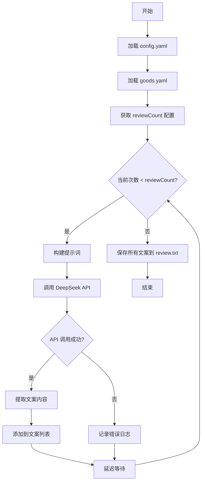
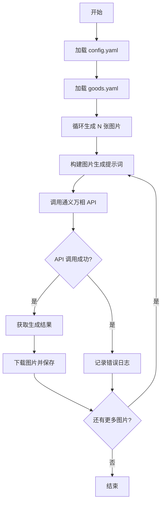

# BuyerShowTool 项目指导文档

## 一、项目概述

本项目是一个基于 Bun 运行时 + TypeScript 开发的自动化工具，用于根据商品资料（JSON/YAML格式）和商品图片，自动生成买家好评文案和买家秀模特图。

### 核心功能

- **好评文案生成**：调用 DeepSeek 文生文 API，根据商品信息和图片生成80字左右的买家好评文案
- **买家秀图片生成**：调用阿里云通义万相文生图 API，生成3-5张模特试穿图，要求不出现模特面部/头部，背景为家居客厅或户外草地

### 技术栈

- **运行环境**：Bun
- **开发语言**：TypeScript
- **操作系统**：Windows
- **配置文件**：YAML

---

## 二、目录结构

```
BuyerShowTool/
├── src/
│   ├── index.ts              # 入口文件，解析命令行参数并调度任务
│   ├── config/
│   │   ├── loader.ts         # 配置文件加载器
│   │   └── types.ts          # 类型定义
│   ├── services/
│   │   ├── goodsParser.ts    # 商品信息解析器
│   │   ├── reviewGenerator.ts # 好评文案生成服务
│   │   └── imageGenerator.ts  # 买家秀图片生成服务
│   ├── api/
│   │   ├── deepseek.ts       # DeepSeek API 封装
│   │   └── tongyi.ts         # 通义万相 API 封装
│   └── utils/
│       ├── logger.ts         # 日志工具
│       └── file.ts           # 文件操作工具
├── config.yaml               # 项目根目录配置文件（用户可自定义）
├── package.json
├── tsconfig.json
└── README.md
```

---

## 三、配置文件说明

### 3.1 项目根目录 config.yaml

用户需要在项目根目录创建 `config.yaml`，内容如下：

```yaml
# DeepSeek API 配置（用于生成好评文案）
deepseek:
  # API 请求地址
  url: "https://api.deepseek.com/v1/chat/completions"
  # API 密钥
  apiKey: "your-deepseek-api-key-here"
  # 前调提示词（后续会拼接目标路径下的 goods.yaml 作为完整提示词）
  systemPrompt: |
    你是一位专业的电商运营专家，擅长撰写真实、客观的买家好评文案。
    请根据提供的商品信息生成买家好评文案。
    要求：
    - 字数80字左右
    - 使用较为中肯的语气
    - 禁止使用感叹号
    - 禁止使用夸张的语态
    - 禁止使用"太棒了"、"超级推荐"等夸张词汇
  # 好评文案生成次数（3-5次，提升可用率的命中）
  # 每次生成会基于相同的商品信息但可能产生不同的文案
  # 最终会保存所有生成的文案供用户选择
  reviewCount: 4

# 通义万相 API 配置（用于生成买家秀图片）
tongyi:
  # API 请求地址
  url: "https://dashscope.aliyuncs.com/api/v1/services/aigc/text2image/generation"
  # API 密钥
  apiKey: "your-tongyi-api-key-here"
  # 前调提示词（后续会拼接商品信息作为完整提示词）
  systemPrompt: |
    请生成一张电商买家秀模特图。
    要求：
    - 模特不出现面部和头部
    - 背景为家居室内客厅环境或户外草地环境
    - 随机生成合适的姿势
    - 图片主体为商品本身
    - 画面真实自然，符合真实买家秀风格
  # 输出图片数量（3-5张）
  imageCount: 4
```

### 3.2 目标路径下的 goods.yaml

在执行命令时，需要在目标路径（如 `C:\example\dir`）下放置一个 `goods.yaml` 文件，内容包含商品信息：

```yaml
# 商品基本信息
goods:
  # 商品名称
  name: "纯棉休闲T恤"
  # 品类
  category: "T恤"
  # 适用性别
  gender: "男"
  # 适用年龄
  ageGroup: "青年"
  # 年份
  year: "2024"
  # 季节
  season: "春夏季"
  # 裤长（如果是裤子）
  pantsLength: ""
  # 袖长
  sleeveLength: "短袖"
  # 领型
  collarType: "圆领"
  # 穿戴方式
  wearType: "套头"
  # 特殊卖点或功能
  features:
    - "100%纯棉材质"
    - "透气吸汗"
    - "不起球不变形"
    - "多色可选"

# 商品图片文件列表（支持 jpg/jpeg/png）
images:
  - "front.jpg"      # 正面平铺图
  - "back.jpg"       # 背面平铺图
  - "detail1.jpg"    # 细节图1
  - "detail2.jpg"    # 细节图2
```

---

## 四、输入输出说明

### 4.1 执行命令

```bash
bun run src/index.ts "C:\example\dir"
```

### 4.2 输入要求

1. **目标路径**：命令行传入的目录路径
2. **配置文件**：`目标路径/goods.yaml` 必须存在
3. **商品图片**：目标路径下应包含 `goods.yaml` 中指定的图片文件

### 4.3 输出结果

执行完成后，在目标路径下生成以下文件：

```
C:\example\dir\
├── goods.yaml              # 原有的商品配置文件
├── front.jpg              # 原有的商品图片
├── back.jpg               # 原有的商品图片
├── detail1.jpg            # 原有的商品图片
├── detail2.jpg            # 原有的商品图片
├── review.txt             # 生成的好评文案（80字左右）
├── buyer_show_1.jpg       # 生成的买家秀图片1
├── buyer_show_2.jpg       # 生成的买家秀图片2
├── buyer_show_3.jpg       # 生成的买家秀图片3
├── buyer_show_4.jpg       # 生成的买家秀图片4
└── error.log              # 错误日志（如有）
```

### 4.4 好评文案输出示例

生成的 `review.txt` 内容示例（包含多条文案）：

```
=== 第1条 ===
质量很好，面料是纯棉的，穿在身上很舒服透气。尺码标准，洗了几次也没有变形掉色。款式简约大方，搭配裤子裙子都好看。性价比不错，值得购买。

=== 第2条 ===
面料柔软舒适，纯棉材质透气不闷热。版型合身，做工精细没有线头。颜色正没有色差，穿起来很显气质。总体满意，会推荐给朋友。

=== 第3条 ===
衣服质量不错，棉质面料手感很好。穿着很舒服，透气性强。尺码偏大一点，建议拍小一码。样式简单大方，整体性价比可以。

=== 第4条 ===
收到货了，质量比想象的要好。面料是纯棉的，穿在身上很柔软。洗了一次没有缩水变形，品质不错。款式经典百搭，值得购买。
```

---

## 五、核心模块设计

### 5.1 入口模块 (src/index.ts)

**职责**：
- 解析命令行参数，获取目标路径
- 加载项目根目录的 `config.yaml`
- 加载目标路径下的 `goods.yaml`
- 调度好评文案生成和图片生成任务
- 统一处理错误和日志输出

**关键函数**：
```typescript
async function main(): Promise<void>
```

### 5.2 配置加载器 (src/config/loader.ts)

**职责**：
- 加载并解析项目根目录的 `config.yaml`
- 加载并解析目标路径下的 `goods.yaml`
- 验证配置文件的必要字段
- 提供类型安全的配置访问接口

**关键类型**：
```typescript
interface Config {
  deepseek: {
    url: string;
    apiKey: string;
    systemPrompt: string;
    reviewCount: number;  // 好评文案生成次数（3-5次）
  };
  tongyi: {
    url: string;
    apiKey: string;
    systemPrompt: string;
    imageCount: number;
  };
}

interface GoodsInfo {
  goods: {
    name: string;
    category: string;
    gender: string;
    ageGroup: string;
    year: string;
    season: string;
    pantsLength?: string;
    sleeveLength: string;
    collarType: string;
    wearType: string;
    features: string[];
  };
  images: string[];
}
```

### 5.3 商品信息解析器 (src/services/goodsParser.ts)

**职责**：
- 解析 YAML 格式的商品信息
- 验证商品信息的完整性
- 将商品信息转换为适合 API 调用的格式

### 5.4 好评文案生成服务 (src/services/reviewGenerator.ts)

**职责**：
- 构建发送给 DeepSeek API 的提示词
- 循环调用 DeepSeek API 生成多次好评文案（默认3-5次）
- 将所有生成的好评文案保存到目标路径的 `review.txt`
- 每次生成可设置不同的 temperature 参数以增加多样性

**提示词构建逻辑**：
```
系统前调提示词（来自 config.yaml）
+
商品信息（来自 goods.yaml）
+
"请生成80字左右的买家好评文案"
```

**多次生成逻辑**：
- 根据 `config.yaml` 中的 `reviewCount` 配置确定生成次数（建议3-5次）
- 循环调用 DeepSeek API，每次调用使用不同的 temperature 值（0.7-1.0之间随机）
- 将所有生成的文案保存到 `review.txt`，格式如下：
  ```
  === 第1条 ===
  [生成的文案内容]
  
  === 第2条 ===
  [生成的文案内容]
  
  === 第3条 ===
  [生成的文案内容]
  ...
  ```
- 每次生成之间添加适当的延迟，避免 API 限流

### 5.5 买家秀图片生成服务 (src/services/imageGenerator.ts)

**职责**：
- 构建发送给通义万相 API 的提示词
- 调用通义万相 API 生成买家秀图片
- 将生成的图片保存到目标路径 `buyer_show_N.jpg`

**提示词构建逻辑**：
```
系统前调提示词（来自 config.yaml）
+
商品名称：{name}
+
商品品类：{category}
+
适用性别：{gender}
+
年龄：{ageGroup}
+
年份：{year}
+
季节：{season}
+
袖长：{sleevelength}
+
领型：{collarType}
+
特殊卖点：{features}
+
"请生成一张买家秀模特图，背景为{随机选择：家居室内客厅/户外草地}，模特姿势自然，图片主体为商品本身，不显示模特面部和头部"
```

### 5.6 DeepSeek API 封装 (src/api/deepseek.ts)

**职责**：
- 封装 DeepSeek Chat API 调用
- 处理请求和响应
- 错误处理和重试机制

**API 调用示例**：
```typescript
interface DeepSeekRequest {
  model: string;           // 如 "deepseek-chat"
  messages: Array<{
    role: "system" | "user";
    content: string;
  }>;
  temperature?: number;
  max_tokens?: number;
}

interface DeepSeekResponse {
  choices: Array<{
    message: {
      content: string;
    };
  }>;
}
```

### 5.7 通义万相 API 封装 (src/api/tongyi.ts)

**职责**：
- 封装通义万相文生图 API 调用
- 处理图片生成请求
- 错误处理和重试机制

**API 调用示例**：
```typescript
interface TongyiRequest {
  model: string;           // 如 "wanx-v1"
  input: {
    prompt: string;
  };
  parameters: {
    size?: string;         // 如 "1024x1024"
    n?: number;            // 生成图片数量
  };
}

interface TongyiResponse {
  output: {
    task_id: string;
  };
  request_id: string;
}
```

---

## 六、API 调用流程

### 6.1 好评文案生成流程（多次生成）



### 6.2 买家秀图片生成流程



---

## 七、错误处理

### 7.1 配置文件错误

- `config.yaml` 不存在：提示用户创建配置文件
- `goods.yaml` 不存在：提示用户在目标路径下创建商品配置文件
- 配置文件格式错误：提示具体的解析错误

### 7.2 API 调用错误

- 网络错误：记录错误日志，继续执行其他任务
- API 密钥错误：提示用户检查 API 密钥配置
- API 配额不足：提示用户检查 API 配额

### 7.3 文件操作错误

- 图片文件不存在：跳过该图片，继续处理
- 文件写入失败：记录错误日志

---

## 八、使用示例

### 8.1 准备目标路径

假设目标路径为 `C:\example\dir`，需要创建以下文件：

```
C:\example\dir\
├── goods.yaml
├── front.jpg
├── back.jpg
└── detail.jpg
```

### 8.2 执行命令

```bash
bun run src/index.ts "C:\example\dir"
```

### 8.3 查看结果

执行完成后，在目标路径下查看生成的文件：

```
C:\example\dir\
├── goods.yaml
├── front.jpg
├── back.jpg
├── detail.jpg
├── review.txt              # 生成的好评文案
├── buyer_show_1.jpg       # 生成的买家秀图片
├── buyer_show_2.jpg
├── buyer_show_3.jpg
└── buyer_show_4.jpg
```

---

## 九、注意事项

1. **API 密钥安全**：不要将包含真实 API 密钥的配置文件提交到版本控制系统
2. **网络环境**：确保运行环境中可以访问 DeepSeek 和阿里云通义万相的 API
3. **图片格式**：支持 jpg/jpeg/png 格式的图片文件
4. **YAML 格式**：注意 YAML 文件的缩进和格式，避免解析错误
5. **并发限制**：根据 API 的并发限制，合理设置图片生成数量

---

## 十、后续扩展

1. **支持更多 API 提供商**：可以扩展支持其他文生文、文生图 API
2. **批量处理**：支持批量处理多个商品目录
3. **自定义模板**：支持用户自定义好评文案的模板
4. **图片风格选择**：支持用户选择不同的买家秀背景风格
5. **日志系统**：支持更详细的日志记录和日志轮转